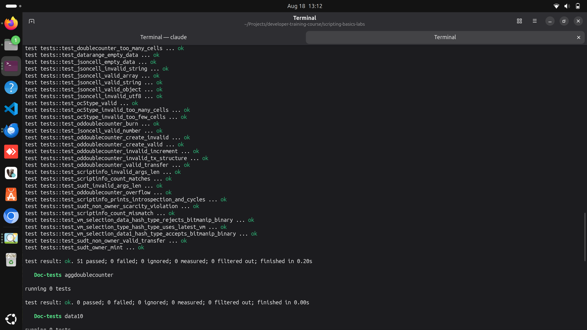
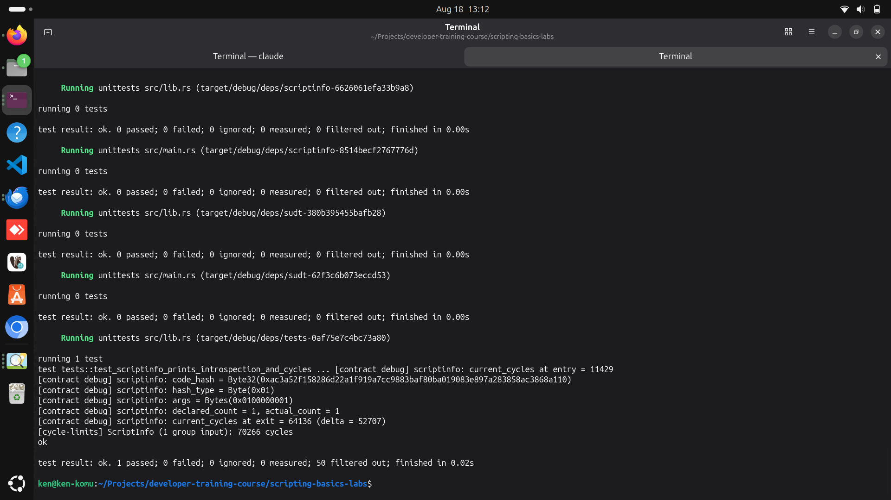
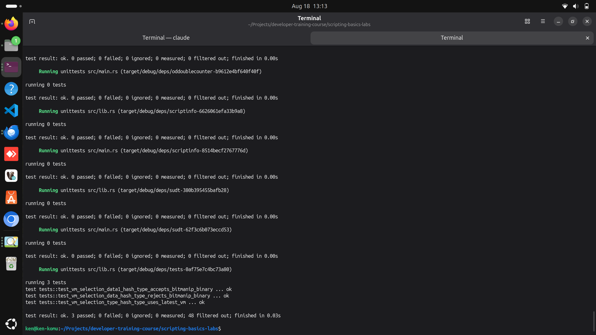
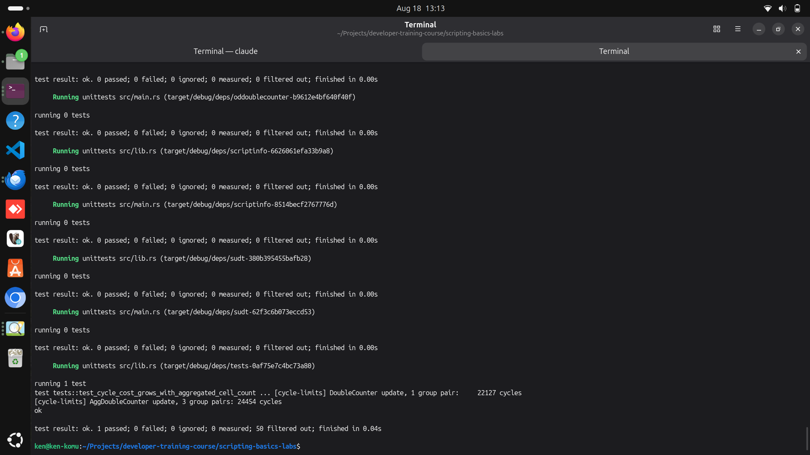

## Builder Track Weekly Report — Week 10

**Name:** Kenneth Komu Njoroge\
**Week Ending:** 08-11-2026

---

### Courses Completed

- **Nervos Docs — CKB-VM & Script Internals** (the Developer Training Course itself ended at Week 9's SUDT lab — this week moves from the lesson/lab format into the primary reference docs at docs.nervos.org)
  - [Intro to Script](https://docs.nervos.org/docs/script/intro-to-script) — reviewed the `Script` structure (`code_hash`, `hash_type`, `args`) and the lock-vs-type execution asymmetry (a cell's own Lock Script never runs; only an input's does), then built a script that reads its own `Script` struct back out at runtime instead of just treating those fields as configuration.
  - [Syscalls for Script](https://docs.nervos.org/docs/script/syscalls-for-script) — went through the syscall catalog (transaction/cell/header loaders, `debug`, `current_cycles`, `exec`/`spawn`) and used three of them directly for the first time: `load_script`, `debug`, and `current_cycles`.
  - [VM Cycle Limits](https://docs.nervos.org/docs/script/vm-cycle-limits) — learned there's no per-script cycle limit, only a per-block ceiling (`max_block_cycles`), and that cost is just addition: a fixed charge per instruction/syscall plus per-byte charges for loading and I/O.
  - [VM Selection](https://docs.nervos.org/docs/script/vm-selection) — learned that `hash_type` isn't just a hash-matching mode, it selects which CKB-VM version runs the script (`data`→VM0, `data1`→VM1, `data2`→VM2, `type`→always the latest), and confirmed this against a question left open since Week 9.

Since these four pages are standalone reference docs rather than lesson-plus-lab pairs, there was no official lab to run. I built the hands-on component myself: a new `scriptinfo` contract plus three test groups (all in the existing `scripting-basics-labs` workspace) that turn each doc's claims into something that could fail if the claim were wrong.

---

### Key Learnings

- **Script structure and syscalls, made visible**
  - Every contract so far has treated `code_hash`/`hash_type`/`args` as configuration handed to it from the outside. `ScriptInfo` is the first one that calls `load_script()` on itself and reads those fields back at runtime, then prints them with `debug!` alongside `current_cycles()` taken right before and after validation.
  - The syscall mechanics turned out to matter as much as the values: `debug!` only compiles in when `-C debug-assertions` is set (it already is, workspace-wide, via the Makefile's `RUSTFLAGS`), and ckb-testtool prints every debug message to stdout prefixed `[contract debug]` by default — no extra setup needed, just `cargo test <name> -- --nocapture`. Seeing `current_cycles()` return two different numbers 15 lines apart, in a script I wrote, made "cycles" stop being an abstract cost model and start being a real number I can read off my own code.

- **hash_type is a VM selector, and our own test suite had been picking one for us the whole time**
  - The Week 9 memory note on `hashType` was written as an empirical rule: our binaries need `"data1"`, course binaries need `"data"`. The VM Selection doc explains *why* — `data`/`data1`/`data2` pin execution to VM0/VM1/VM2 respectively, while `type` always uses whatever VM is newest, trading determinism for automatic access to new RISC-V extensions.
  - That reframing surfaced something I'd missed: every Rust test in this workspace builds its scripts with `context.build_script()`, and ckb-testtool's `build_script()` defaults to `ScriptHashType::Type` — not `Data1`. It works because `Context::deploy_cell()` gives every code cell a random Type ID script specifically so `Type`-hash lookups resolve. That's *why* our bitmanip-compiled contracts have passed every Rust test since Week 9 without me ever choosing a hash_type there, while the Lumos labs needed the explicit `"data1"` choice I had to reason out by hand. I confirmed this by building the same DoubleCounter binary three ways with `build_script_with_hash_type()`: `Data` (VM0) fails with a real VM error (`MemWriteOnExecutablePage`), `Data1` and `Type` both succeed.

- **Cycles are the real budget, and they're just addition**
  - The doc's model (fixed cost per instruction/syscall, no per-script ceiling, only a block-wide one) predicts that doing the same check more times costs proportionally more. I tested that directly: a DoubleCounter update touching one group pair consumed 22,127 cycles; an AggDoubleCounter update touching three pairs of the same shape consumed 24,454. More cells to loop over, more cycles — not a huge jump for +2 pairs, since the fixed cost of loading the script binary itself dominates at this scale, but the direction and the mechanism (extra `load_cell_data` calls, extra loop iterations) matched the theory exactly.

---

### Proof of Work

**Full workspace test suite — 51 Rust unit tests (43 from Weeks 7-9 plus 8 new this week for ScriptInfo, VM Selection, and Cycle Limits), all passing:**

**ScriptInfo introspection — `load_script()`, `debug!`, and `current_cycles()` run against the contract itself, showing its own code_hash/hash_type/args and the cycle delta of its own validation:**

**VM Selection — the same DoubleCounter binary built three ways: `data` (VM0) rejects it, `data1` (VM1) and `type` (latest VM) both accept it:**

**Cycle Limits — comparing the cycle cost of a 1-pair DoubleCounter update against a 3-pair AggDoubleCounter update:**

---

### Reflections

With the Developer Training Course itself finished at Week 9, this week was about going one level down — from "how do I build a script that does X" to "what is CKB-VM actually doing while my script runs." Reading the four reference docs without a paired lab meant I had to decide for myself what "hands-on" looked like, so I picked the approach the last nine weeks had already been training me toward: turn each doc's claim into a test that fails if the claim is wrong. That paid off immediately — trying to demonstrate VM Selection surfaced a real, previously-unexamined detail in my own project: the Rust test harness has been silently using `ScriptHashType::Type` (always-latest-VM) this entire time via a Type ID script ckb-testtool attaches automatically, which is a completely different mechanism from the `"data1"` I had to choose deliberately for the Lumos labs. Neither choice was wrong, but I'd been getting away with not understanding the difference until I went looking for it on purpose. That's the shift this week represents: without a course structure telling me what to build next, the primary docs plus "can I make this fail" became the syllabus.

---
