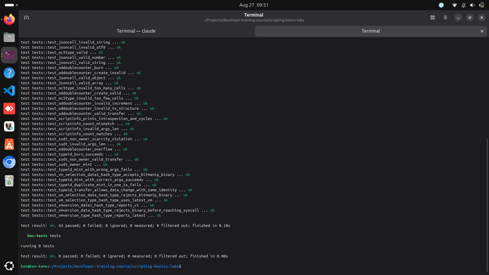
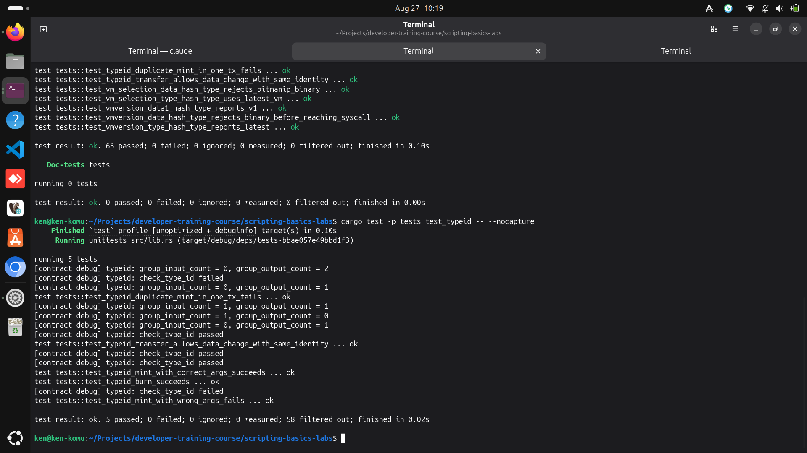
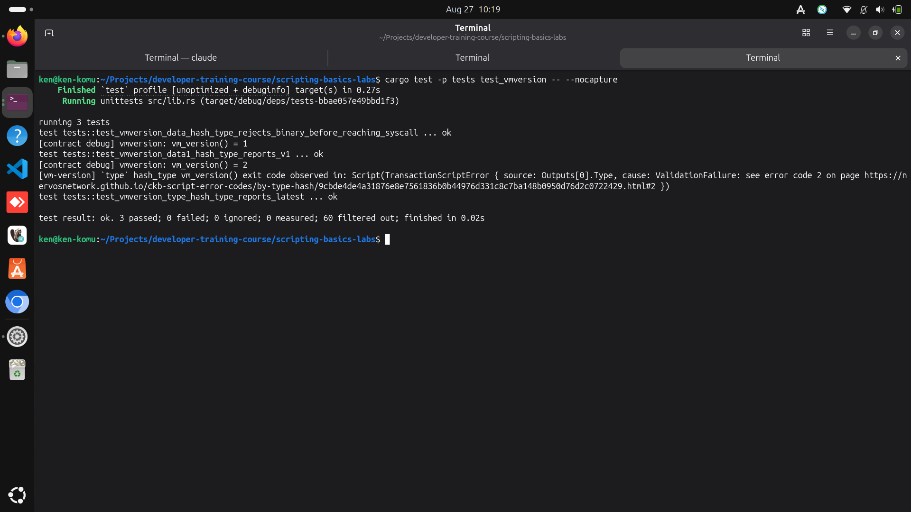
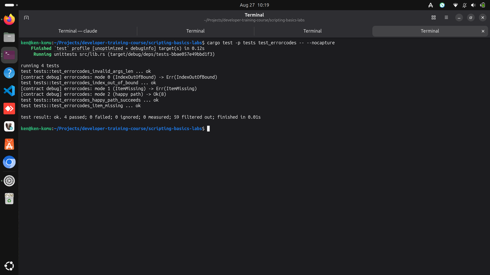

## Builder Track Weekly Report — Week 11

**Name:** Kenneth Komu Njoroge\
**Week Ending:** 08-18-2026

---

### Courses Completed

- **Nervos Docs — Script Upgradability & VM Introspection** (continuing the docs.nervos.org Script reference series started in Week 10, working through the next pages in the "Smart Contract Basics" sidebar)
  - [Type ID for Upgradable Scripts](https://docs.nervos.org/docs/script/type-id) — learned how CKB lets exactly one live Cell hold a given identity on-chain (a Type ID), and used `ckb-std`'s own `type_id` module instead of hand-rolling the blake2b derivation myself.
  - [Script Upgrade Workflow](https://docs.nervos.org/docs/script/script-upgrade-workflow) — learned that Type ID only gives a Cell a stable identity; whether it can actually be upgraded is entirely down to the Lock Script guarding it, and that a Type Script's own validation never re-checks anything once a Cell is legitimately being transferred.
  - [VM Version History](https://docs.nervos.org/docs/script/vm-version) — went from "hash_type picks a VM" (Week 10) to what actually differs between VM0/VM1/VM2, and used the `vm_version` syscall to ask a running script which one it's on.
  - [Common Script Error Codes](https://docs.nervos.org/docs/script/common-script-error-code) — learned CKB's own syscall-level error numbers (as opposed to a script's custom exit codes) and deliberately triggered two of them.

As with Week 10, these are standalone reference pages, not lesson-plus-lab pairs, so I designed the hands-on component myself: a `typeid` contract plus a `vmversion` and `errorcodes` contract (all three new this week, in the existing `scripting-basics-labs` workspace), and 12 new tests turning each doc's claims into something checkable.

---

### Key Learnings

- **Type ID is an identity, not a lock — Script Upgrade Workflow is what decides if that identity can move**
  - `TypeId` doesn't reimplement the Type ID rule from scratch; it's a two-line wrapper around `ckb_std::type_id::check_type_id`, ckb-std's own reference implementation of the exact rule the doc describes: a mint (0 GroupInput / 1 GroupOutput) must carry `args == blake2b(first tx CellInput || own output index)`; a transfer (1 GroupInput / 1 GroupOutput) or burn (1 GroupInput / 0 GroupOutput) is *always* allowed, with no re-check of args or data at all.
  - That last part is the whole point of the Script Upgrade Workflow doc, and it's directly testable: `test_typeid_transfer_allows_data_change_with_same_identity` spends a Type ID cell holding `"v1 code"` and recreates it holding `"v2 code, totally different"`, with the exact same Type ID args on both sides — and it passes. The Type Script never even looks at the data. Whether that upgrade is *allowed to happen at all* is a question the Type Script has already opted out of answering; it's purely the Lock Script's job.

- **VM Version History resolved a number I'd only inferred before**
  - Week 10 established that `hash_type: "type"` always means "the latest available VM," without pinning down what that actually was. This week's `VmVersion` contract calls the `vm_version` syscall on itself and returns the result as its own exit code, so the test doesn't have to assume anything: under `data1` it reports `1`; under `type` it reports `2` — meaning this toolchain's "latest" is genuinely VM2, not VM1 as I might have guessed from Week 10 alone.
  - I tried to also show `vm_version()`'s unavailability under VM0 as a distinct outcome, but ran into a real limit of this environment: every contract in this workspace is compiled with the same RISC-V bitmanip extensions (per the Makefile's `RUSTFLAGS`), so under `data` (VM0) the binary is rejected before `program_entry()` ever runs — the same `MemWriteOnExecutablePage` fault Week 10 hit, not a syscall-specific error. I kept the test, but rewrote it to assert what's actually true (VM0 rejects the binary outright) instead of the narrower claim I couldn't isolate.

- **Error codes have two separate number spaces, and mixing them up would be a real bug**
  - Every contract so far has used small custom `i8` exit codes starting at 4 (`ERROR_ENCODING`, `ERROR_ARGS_LEN`, etc.) for its own validation logic. The Common Script Error Codes doc is about a *different* space entirely: the syscall-level codes CKB itself defines (`IndexOutOfBound = 1`, `ItemMissing = 2`, ...), returned by the syscalls a script calls, not by the script's own `return` statements.
  - `ErrorCodes` deliberately triggers both: `load_cell()` on an out-of-range index for `IndexOutOfBound`, and `load_cell_by_field(..., CellField::Type)` on a cell with no type script for `ItemMissing`. Building this exposed a real bug in my first draft — I queried `Source::GroupInput` for a cell that only had this script attached to its *output*, so `GroupInput` was empty and every mode failed the same way (index 0 out of bounds in an empty group), not the way I intended. Switching to plain `Source::Input` (the whole transaction's inputs, not just cells sharing this exact script) fixed it — a concrete reminder that Group-prefixed sources are narrower than they look.

---

### Proof of Work

**Full workspace test suite — 63 Rust unit tests (51 from Weeks 7-10 plus 12 new this week for TypeId, VmVersion, and ErrorCodes), all passing:**

**Type ID & Script Upgrade Workflow — mint, transfer-with-different-data, burn, and duplicate-mint tests, with debug output showing the GroupInput/GroupOutput counts driving each outcome:**

**VM Version — `vm_version()` called from inside a running script, reporting 1 under `data1` and 2 under `type`:**

**Common Script Error Codes — `IndexOutOfBound` and `ItemMissing` triggered deliberately and reported back via debug output:**

---

### Reflections

This week continued the pattern Week 10 forced me into: no paired lab, so the reference doc plus "can I make this fail" became the syllabus. The most useful moment wasn't a success, though — it was the `ErrorCodes` bug. My first version of that contract queried `Source::GroupInput` because every other contract in this workspace does, and it silently tested the wrong thing (an empty group, not "a cell without a type script") until the test run showed error code 6 where I expected 2. That's a small mistake, but it's exactly the kind Group-vs-plain-Source confusion the Common Script Error Codes doc doesn't warn about explicitly — I only found it by writing a test that could disagree with me. The other real finding was on the VM Version side: I went in assuming Spawn and IPC (the two topics right after these four in the sidebar) might not even be supported by this toolchain, based on an initial search that turned out to be looking in the wrong crate — `ckb-vm` is the generic RISC-V interpreter, but CKB's own syscalls including `spawn`, `pipe`, and `wait` are implemented one layer up, in `ckb-script`, where they're very much present. Confirming `vm_version()` genuinely reports `2` (not capped at `1`) closes that question properly: VM2 is real and reachable here, which means Spawn and IPC are legitimately buildable — they're just big enough (a second script binary, a multi-process VM, pipe-based request/response) that they deserve their own week rather than being the rushed fifth topic in this one.

---
