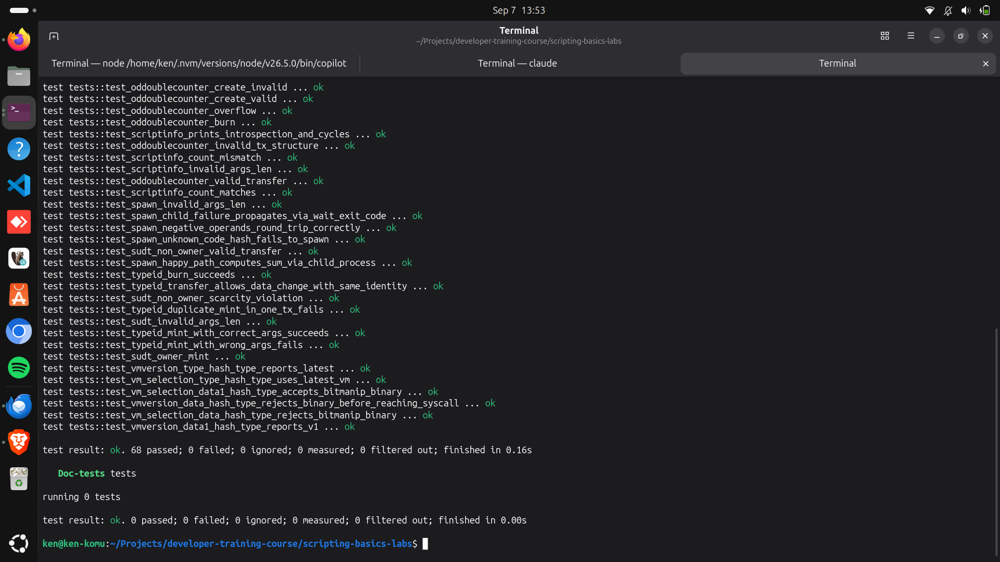
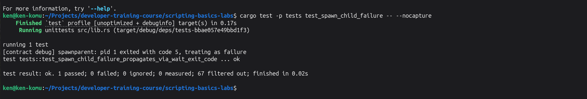

## Builder Track Weekly Report — Week 12

**Name:** Kenneth Komu Njoroge\
**Week Ending:** 08-25-2026

---

### Courses Completed

- **Nervos Docs — Cross-Script Calls & IPC** (continuing the docs.nervos.org Script reference series from Weeks 10–11, working through the next pages in the "Smart Contract Basics" sidebar)
  - [Program Language for Script](https://docs.nervos.org/docs/script/program-language-for-script) — a purely informational page (no lab, no API), covering which languages can target CKB-VM: Rust as the recommended, most complete toolchain (what this project has used since Week 7); C as a proven production alternative (sUDT/xUDT); JavaScript and Lua as interpreter-based options (`ckb-js-vm`, `ckb-lua-vm`) with an acknowledged performance cost; and, in principle, anything else via a language-specific VM deployed as its own on-chain script.
  - [Spawn: Cross-Script Calls](https://docs.nervos.org/docs/script/spawn-cross-script-calling) — learned how `Spawn` differs from the `exec` syscall already covered in Week 10's syscall catalog: `exec` replaces the current process outright, while `spawn` starts a genuinely separate child process and **returns control to the caller**, which is what makes a result-and-continue pattern possible at all.
  - [Inter-Process Communication (IPC)](https://docs.nervos.org/docs/script/ckb-ipc) — learned the pipe/fd model `Spawn` enables: a parent creates a pipe, keeps one end, and hands the other end to the child as an "inherited fd"; the child talks back over that fd instead of any return value, and the parent separately blocks on `wait()` for the child's own exit code.

Same as Weeks 10–11, these are reference pages, not lesson-plus-lab pairs, so I designed the hands-on component myself: `spawnchild` and `spawnparent` (both new this week, in the existing `scripting-basics-labs` workspace), plus 5 new tests exercising a real two-process spawn/pipe/wait cycle — the first contract this course has built that can't be demonstrated with a single script.

---

### Key Learnings

- **Spawn and IPC are one mechanism, not two — and it takes two scripts to show either one**
  - Every contract through Week 11 was a single script validating a single transaction. `SpawnParent` (a type script) and `SpawnChild` (never attached to any cell as a lock/type script itself — it only ever runs as something `SpawnParent` spawns) are the first pair here that only makes sense together: `SpawnParent` reads a code_hash and two operands out of its own script args, calls `ckb_std::high_level::spawn_cell(code_hash, ScriptHashType::Type, &argv, &[write_fd])`, hands the child the two operands as `argv` strings plus one end of a freshly created `pipe()` as its only inherited fd, and `SpawnChild` reads those two strings back via `ckb_std::env::argv()` — a genuinely different mechanism from `load_script().args()`, populated automatically by `ckb_std::entry!` off the RISC-V process's own startup registers — adds them, and writes the 8-byte sum back down the fd it was handed.
  - Confirmed this is real, not simulated: `ckb-testtool`'s `Context::verify_tx()` builds its `Consensus` with `CKB2023::new_dev_default()`, which is the hardfork that shipped `Spawn` (Meepo) — no `native-simulator` feature or special test setup was needed for `spawn`/`pipe`/`read`/`write`/`wait` to actually execute inside the real CKB-VM interpreter.

- **A callee's failure travels through `wait()`'s exit code, not a `Result`, and it's easy to forget to check**
  - `SpawnParent` accepts a mode byte in its own args purely to force this: mode 1 sends a deliberately non-numeric first `argv` string to `SpawnChild`, which hits its own `ERROR_ARGV_PARSE` and exits with code 5 *without ever writing to or closing the pipe*. `wait(pid)` still returns `Ok(5)` — success at the syscall level, carrying the child's real exit code as data — and it's entirely up to `SpawnParent` to notice that 5 isn't 0 and refuse to trust whatever ended up in its read buffer. `test_spawn_child_failure_propagates_via_wait_exit_code` locks this in, and the debug output shows it plainly: `spawnparent: pid 1 exited with code 5, treating as failure`. Skipping that check would have been the easy bug to write and the hard one to notice, since nothing about a bad exit code looks like a Rust error until you check for it.
  - A second, independent failure path exists one level earlier: `spawn_cell()` itself returns `Err` if the code_hash it's given doesn't match anything in the transaction's `CellDep`s — `test_spawn_unknown_code_hash_fails_to_spawn` triggers this directly with a code_hash no deployed cell carries, confirming these are two genuinely separate things a caller has to handle (can the child even start, vs. did the child finish cleanly).

- **A real question about a real risk, settled by testing rather than assumed either way**
  - Going in, I wasn't sure whether `SpawnParent`'s `read()`-then-`wait()` ordering (matching the doc's own example) would hang on the failure path — `SpawnChild` exits early there without ever calling `write()` or `close()` on its inherited fd, and a real OS pipe with an fd nobody closes can absolutely deadlock a naive reader. It didn't: `test_spawn_child_failure_propagates_via_wait_exit_code` returns immediately with the expected error, which only makes sense if CKB-VM tears down a process's file descriptors automatically when it exits, closed-by-hand or not. That's not something either fetched doc page stated outright — I only know it's true here because I wrote the test that would have hung or timed out if it weren't, and it didn't.
  - I also didn't assume `read()` would return all 8 bytes of the sum in one call just because `write()` sent them in one call — pipes are a byte stream, not a message queue, so `SpawnParent` loops `read()` until its buffer is full or the peer signals `Ok(0)`/`OtherEndClosed`. In this implementation a single call did return the full 8 bytes every time, but the loop is correct regardless of that detail, which is exactly the point: neither doc page promises write-call boundaries survive to the reader, so the code doesn't rely on it even though it happened to work without the loop.

- **Cross-process calls have a real, measurable cycle cost**
  - `test_spawn_happy_path_computes_sum_via_child_process` printed **159,210 cycles** for one full spawn → pipe → wait cycle over two trivial scripts (parse two small integers, add them, copy 8 bytes). Week 10's `AggDoubleCounter` cycle-cost test measured roughly 22,000–24,000 cycles for a single-process, three-cell-group update — meaningfully more real logic than either `SpawnParent` or `SpawnChild` does alone. The gap is the cost of standing up and tearing down an entire second CKB-VM process (loading a second binary, syscall overhead for `spawn`/`pipe`/`read`/`write`/`wait`), not the arithmetic. This is a concrete number behind Week 10's abstract claim that cost is "just addition, no free allowance for anything" — spawning is expensive specifically because there's no discount for what the spawned process is *for*.

---

### Proof of Work

**Full workspace test suite — 68 Rust unit tests (63 from Weeks 7–11 plus 5 new this week for SpawnParent/SpawnChild), all passing, with the documentation test target also completing successfully:**

**Spawn/IPC targeted failure-propagation test — SpawnChild exits with code 5 after receiving invalid input, and SpawnParent observes that exit code through `wait()`:**

---

### Reflections

This closes out something Week 11 flagged and deliberately deferred: `vm_version()` confirmed VM2 was genuinely reachable in this toolchain, which meant Spawn and IPC were buildable, but a parent-plus-child pipe demo was clearly a bigger, separate piece of work than the fifth topic in an already-full week. It turned out to be worth the wait as its own week — this is the first contract in twelve weeks that couldn't be written as one script validating one transaction, and the two real risks in it (does the read-then-wait ordering deadlock on a child that dies without cleaning up after itself; does a single read() actually get everything a single write() sent) were both things I could have quietly assumed my way past instead of testing. Writing the deliberate-failure test first, before I fully trusted the happy path, is what actually answered the deadlock question — if CKB-VM didn't auto-close a dead process's file descriptors, that test would have hung instead of passing, and I'd have found out from a stuck test run rather than a design review. The "Program Language for Script" page also earned its place in this week: reading it right before building SpawnParent/SpawnChild in Rust made concrete why the docs treat Rust as the default rather than one option among equals here — the JS/Lua/other-language paths documented are real, but they're an interpreter running inside a script inside a transaction, and this week's own cycle numbers (159,210 for two trivial Rust binaries) make it obvious why stacking an interpreter on top of that is a cost most CKB scripts wouldn't choose to pay. What's left in the sidebar after this week: Debug/Upgrade & Error Codes (`debug-script` — a page about debugging and upgrading scripts, distinct from the syscall-level Common Script Error Codes page Week 11 already covered) and Testing & Fuzzing (`script-testing-guide`, `fuzzing-ckb-scripts`) — a natural, smaller pairing for Week 13 after two weeks that both grew larger than planned.

---
