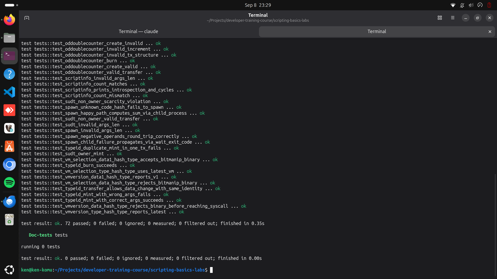
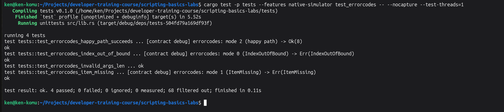

## Builder Track Weekly Report — Week 13

**Name:** Kenneth Komu Njoroge\
**Week Ending:** 09-08-2026

---

### Courses Completed

- **Nervos Docs — Debugging & Testing** (closing out the docs.nervos.org Script reference series started in Week 10 — this is the last pairing Week 12 flagged as remaining)
  - [Debug/Upgrade Scripts](https://docs.nervos.org/docs/script/debug-script) — the most hands-on reference page yet: covers `ckb-debugger` (a standalone CLI for running/stepping a script outside the Rust test process) and Native Simulator (compiling a contract to run as native code instead of inside the RISC-V VM, for faster iteration). Installed and used both for real, against real transactions from this workspace, not just against the doc's own examples.
  - [Script Testing Guide](https://docs.nervos.org/docs/script/script-testing-guide) — mostly a methodology page (test Lock Scripts by input case since output locks never run; test Type Scripts by input/output count combinations; test grouping-by-hash behavior; construct deliberately invalid transactions) rather than a specific framework — but it makes one very checkable claim, so I checked it.
  - [Fuzzing CKB Scripts](https://docs.nervos.org/docs/script/fuzzing-ckb-scripts) — covers libFuzzer/Honggfuzz/AFL++, corpus formats, and a full hands-on walkthrough using an external reference project (`ckb-zero-lock`, with its own submodules and toolkit). Scaled the same idea down to fit this workspace instead of adopting that external project.

Added `alwaysfailure` (new contract, 2 tests), a native simulator build for `errorcodes` (`errorcodes-sim`), a `fuzz/` crate with a real libFuzzer target, and 2 tests that dump real MockTransaction fixtures for `ckb-debugger` to run against. Test count: 68 → 72.

---

### Key Learnings

- **Native Simulator: scaffolding that's existed since Week 7 but never actually run until now**
  - Every contract's `Cargo.toml` has carried a `native-simulator` feature flag since the very first `ckb-script-templates` scaffold, unused for twelve weeks. `make generate-native-simulator CRATE=errorcodes` builds a small `errorcodes-sim` crate around `ckb_std::entry_simulator!(errorcodes::program_entry)`, compiled as a `cdylib` — genuinely native code, not RISC-V, loaded via `libloading` at test time. `ckb-testtool`'s `deploy_cell_by_name` auto-detects it by a fixed naming convention (`lib<contract>_sim.so`) sitting next to the normal RISC-V binary, so running the *exact same* tests through it needs nothing but `--features native-simulator`.
  - Running it exposed a real bug immediately: Rust's default multi-threaded test runner crashed the whole process (`SIGABRT`, `Once instance has previously been poisoned`) from two tests loading the same shared library concurrently. The fix — `--test-threads=1` — was already sitting, unexplained until now, in this Makefile's own `coverage-run-tests` target from Week 7's original scaffold. I'd copied that flag by convention before without knowing why it was there; now I do.

- **`ckb-debugger`, run against real fixtures this workspace actually produced**
  - `Context::dump_tx()` turns any transaction already built in a Rust test into a `MockTransaction` — the exact JSON format `ckb-debugger` consumes. Dumped both a passing (`errorcodes` happy path) and a failing (`IndexOutOfBound`) transaction from tests already in this suite, then ran the standalone CLI against each independently: same debug log, same exit code, same shape as the Rust test already knew — real cross-tool confirmation, not just a second copy of the same code path.
  - Installing it needed `protoc`, which needed `apt-get`, which needed a `sudo` password I didn't have non-interactively — worked around it by fetching a prebuilt `protoc` release binary straight into `~/.local/bin`, no system package manager involved.
  - Found something I can't fully explain yet: `ckb-debugger --mode fast` reported **20,800 cycles** for the happy-path transaction; `--mode full`'s final "Actual run" pass reported **10,957** for the identical transaction. `full` mode runs the same script multiple times for different instrumentation passes ("collect vm creation," "collect syscalls," "actual run"), and my best guess is the earlier passes carry extra one-time setup cost that the final pass doesn't — but the doc doesn't say this outright, and I haven't confirmed it against ckb-debugger's own source. Flagging it as an open question rather than papering over it with a confident-sounding guess.

- **A doc's claim, turned into two tests instead of one read**
  - The Testing Guide states flatly: "Lock Scripts in Output are NOT executed." `AlwaysFailure` has zero branches — it always returns exit code 1 — specifically so there's nothing else that could explain a pass or fail besides whether it actually ran. As an *input's* lock, the transaction fails with exit code 1, confirming the script does exactly what it says. As an *output-only* lock (input locked by `ALWAYS_SUCCESS` instead), the transaction verifies cleanly. The real proof isn't the pass/fail outcome alone — it's that across both tests, `alwaysfailure`'s debug line appears exactly once, from the input-lock test. Zero appearances from the output-only test is what actually confirms the script never ran there, not just that its failure happened not to matter.

- **Fuzzing, scoped to fit this workspace instead of adopting an external project**
  - The doc's own walkthrough targets `ckb-zero-lock`, a separate repo with git submodules and its own toolkit. Built the same idea directly against this workspace instead: a `fuzz/` crate (`cargo fuzz init`, needs its own `[workspace]` table to opt out of the parent Cargo workspace, and a fresh nightly toolchain since the one already on this machine predates edition 2024) with a libFuzzer target that feeds arbitrary bytes as `errorcodes`' script args — not just the one expected mode byte — through a real `ckb-testtool` transaction via the same native-simulator build from this week's debug-script work, since that's what makes many fast iterations practical at all.
  - **1,395 executions in 30 seconds, zero crashes.** Coverage-guided mutation found all three of `errorcodes`' code paths (modes 0, 1, 2) entirely on its own, starting from an empty corpus. No crash isn't a disappointing result here — the mode-dispatch code already checks `args.len() != 1` before touching anything else, so a fuzzer failing to break it is consistent with, not contrary to, what the contract's own validation already claims to guarantee. The doc itself frames real fuzzing as a 24/7, multi-day-or-month process; 30 seconds is a demonstration that the harness is wired correctly, not a claim of thorough coverage.

---

### Proof of Work

**Full workspace test suite — 72 Rust unit tests (68 from Weeks 7–12 plus 4 new this week for AlwaysFailure and the ckb-debugger fixture dumps), all passing:**

**Native Simulator — the same errorcodes tests running through the compiled native `.so` instead of the RISC-V VM, single-threaded to avoid the shared-library concurrency crash:**

---

### Reflections

This closes out the docs.nervos.org "Smart Contract Basics" Script reference sidebar Week 10 started — every remaining page after Week 9's course ran out is now read and, where it had anything checkable, checked against real code in this workspace rather than taken on faith. The through-line across all four weeks of that pivot (10 through 13) has been the same: a reference doc alone is a claim, and the only way I've found to actually know whether a claim holds in *this* toolchain, on *this* machine, is to build something that would fail if it didn't. That paid off concretely again this week — the native-simulator concurrency crash and the fast/full cycle discrepancy were both things I'd have missed entirely by just reading the pages. The fuzzing scope-down is worth naming honestly too: the doc's own example needs a separate reference project, and rather than force that in during one week, I rebuilt the same underlying idea (coverage-guided mutation against a real CKB transaction) directly against code already in this workspace. It's a smaller fuzzing session than a real security audit would run, but it's a real one, wired correctly, on the actual contract this course produced — not a demo borrowed from somewhere else. With the reference sidebar finished, next week is open: either back into the CKB Builder Track's other material, or a return to the Spark Program grant work this same toolchain is ultimately in service of.

---
