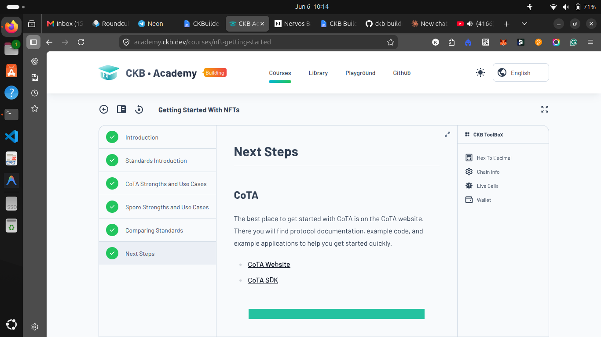
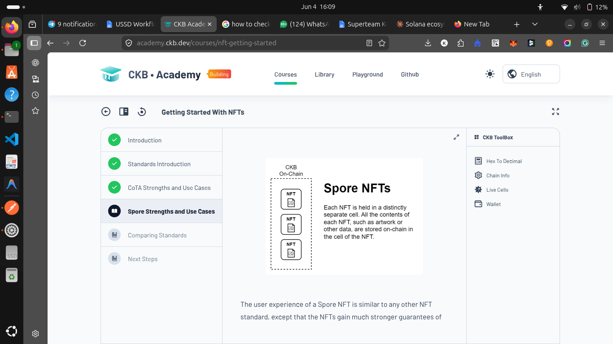

## Builder Track Weekly Report — Week 2

**Name:** Kenneth Komu Njoroge\
**Week Ending:** 06-06-2026

---

### Courses Completed

- **CKB Academy — Getting Started With NFTs**
  - Finished the full [Getting Started With NFTs](https://academy.ckb.dev/courses/nft-getting-started) course, working through every section:
    - Introduction
    - Standards Introduction
    - CoTA Strengths and Use Cases
    - Spore Strengths and Use Cases
    - Comparing Standards
    - Next Steps
  - The course walks through the two main NFT standards on CKB — **CoTA** and **Spore** — and when you'd reach for one over the other.

- **Nervos Developer Training Course — Transactions**
  - Worked through [Sending a Transaction](https://nervos.gitbook.io/developer-training-course/transactions/sending-a-transaction), which covers building and broadcasting a basic transaction on CKB using the `ckb-cli` tool against a local dev blockchain.

---

### Key Learnings

- **NFT standards on CKB (CoTA vs Spore)**
  - **Spore** stores everything on-chain. Each NFT lives in its own separate cell, and all of its data — artwork or anything else — is held directly inside that cell. Because you're paying for the storage capacity, the content gets strong permanence guarantees: it stays on-chain as long as the cell exists.
  - **CoTA** takes the opposite approach and optimizes for cost. Instead of putting the full data on-chain, it keeps a compact, verifiable record on-chain so large collections can be minted much more cheaply. The trade-off is between full on-chain permanence (Spore) and low-cost scalability (CoTA).
  - **Comparing standards** made the decision clearer: pick Spore when on-chain permanence matters most, and CoTA when you're minting at volume and want to keep costs down.

- **Sending a transaction on CKB**
  - **Dev blockchain accounts**: a local dev chain comes with two special genesis accounts that are pre-funded with a large amount of CKBytes, which makes them handy for practicing transfers.
  - **Addresses**: a CKB address is an encoded value that bundles an identity, how it should be accessed, and a checksum so it can't be mistyped. Testnet and mainnet addresses are distinct and can't be used interchangeably — a built-in safeguard against sending to the wrong network.
  - **Transferring CKBytes**: used the `wallet transfer` command with three core parameters:
    - `--from-account` — the account sending the CKBytes
    - `--to-address` — the destination account
    - `--capacity` — the amount being sent (this is the same thing as CKBytes; "capacity" refers to the on-chain storage space that holding the token reserves)
  - After submitting and entering the account password, the command returns a **transaction hash** — the unique ID that identifies the transaction on-chain.

---

### Practical Progress

- Completed the entire **Getting Started With NFTs** course on CKB Academy, ending on the Next Steps section that points toward the CoTA website and SDK for hands-on building.
- Followed the transaction lesson end to end: launched `ckb-cli`, listed accounts, read through the address output, and ran a `wallet transfer` to move CKBytes between the two genesis accounts on a dev blockchain.
- Got familiar with the **CKB Toolbox** utilities surfaced in the Academy (Hex To Decimal, Chain Info, Live Cells, Wallet), which are useful for inspecting chain state while building.

---
