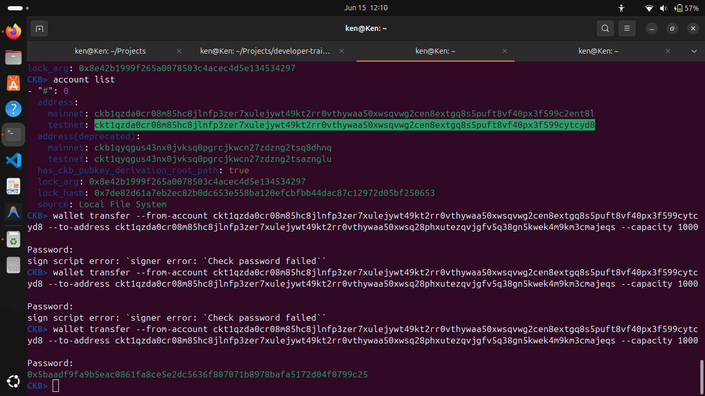
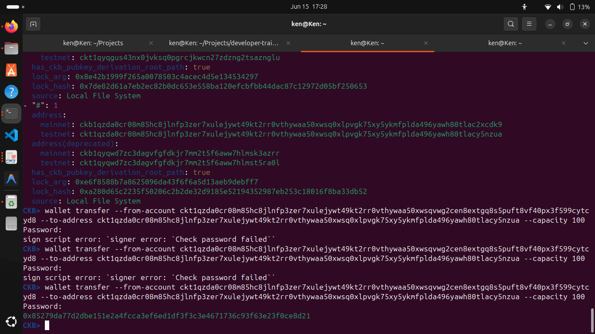
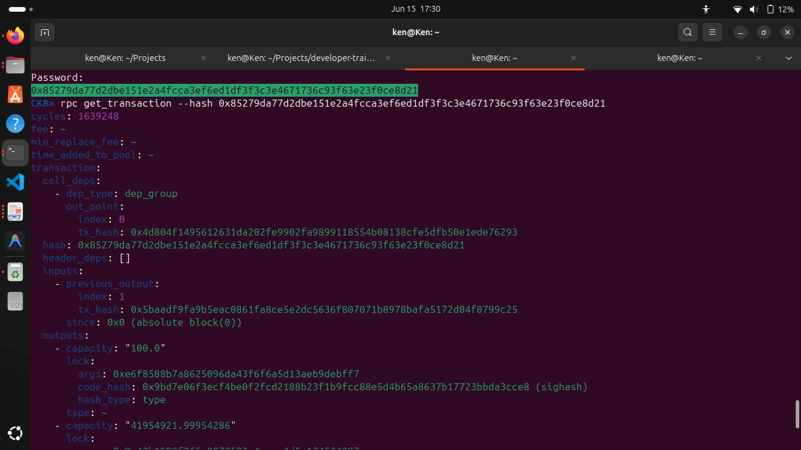

## Builder Track Weekly Report — Week 3

**Name:** Kenneth Komu Njoroge\
**Week Ending:** 06-15-2026

---

### Courses Completed

- **Nervos Developer Training Course — Transactions (continued)**
  - [Sending a Transaction](https://nervos.gitbook.io/developer-training-course/transactions/sending-a-transaction) — revisited and went deeper into how `ckb-cli` builds and broadcasts a transaction.
  - [Lab: Send 100,000 CKBytes](https://nervos.gitbook.io/developer-training-course/transactions/lab-send-100-000-ckbytes) — hands-on lab sending a real transfer between accounts on a local dev node.
  - [Examining a Transaction](https://nervos.gitbook.io/developer-training-course/transactions/examining-a-transaction) — used the RPC to pull back a submitted transaction and read through its full structure.
  - [Lab: Validating Out Points](https://nervos.gitbook.io/developer-training-course/transactions/lab-validating-out-points) — practiced tracing inputs back to the cells they spend.

---

### Key Learnings

- **How a transfer actually works**
  - When you run `wallet transfer`, you're not just sending a number — you're creating a transaction that consumes one or more input cells and produces new output cells. The difference in capacity between inputs and outputs is the fee.
  - The `--capacity` flag sets how much goes to the recipient. The rest goes back to you as change. Everything is in CKBytes (capacity and CKBytes are the same thing).

- **Passwords and accounts**
  - The local keystore encrypts each account's private key with a password. Getting that password wrong gives you `signer error: Check password failed` — which I ran into a few times before getting it right. Once you pass the correct password, `ckb-cli` signs the transaction and broadcasts it, returning a transaction hash.

- **Reading a transaction with RPC**
  - Using `rpc get_transaction --hash <tx_hash>` returns the full raw transaction. The key fields are:
    - `cell_deps` — scripts the transaction depends on (e.g. the lock script that verifies your signature)
    - `inputs` — each input points back to a previous transaction output via `previous_output` (a `tx_hash` + `index` pair — this is the out point)
    - `outputs` — the new cells being created, each with a `capacity` and a `lock`
  - In my transfer, the outputs showed `100.0` going to the recipient and `41954921.99954286` coming back as change.

- **Out points and cell validation**
  - An out point is just a pointer: `tx_hash` + `index`. It identifies exactly which output from a past transaction you're spending. Validating an out point means confirming that cell exists on-chain and hasn't already been spent. This is how CKB prevents double-spends.

---

### Practical Work

- Listed accounts with `ckb-cli account list` to get the testnet address for each account.
- Ran `wallet transfer` from account #0 to account #1, hitting a few password errors before getting the password right and getting back a transaction hash.

- Ran a second transfer between the two accounts, again getting the password wrong a couple of times before succeeding with a new transaction hash.

- Used `rpc get_transaction` with that hash to pull back the full transaction and inspect every field: `cell_deps`, `inputs` with their `previous_output` out points, and `outputs` showing the 100 CKB sent and the change amount returned.

---

### Reflections

This week made the transaction model feel much more concrete. Seeing the raw output of `get_transaction` and tracing the `previous_output` back to an earlier tx hash clicked something that reading the docs alone didn't. The out point concept went from abstract to obvious once I was looking at a real one. The password errors were a small frustration but were a good reminder that `ckb-cli` is signing with a real private key — it's not just simulated.

---
