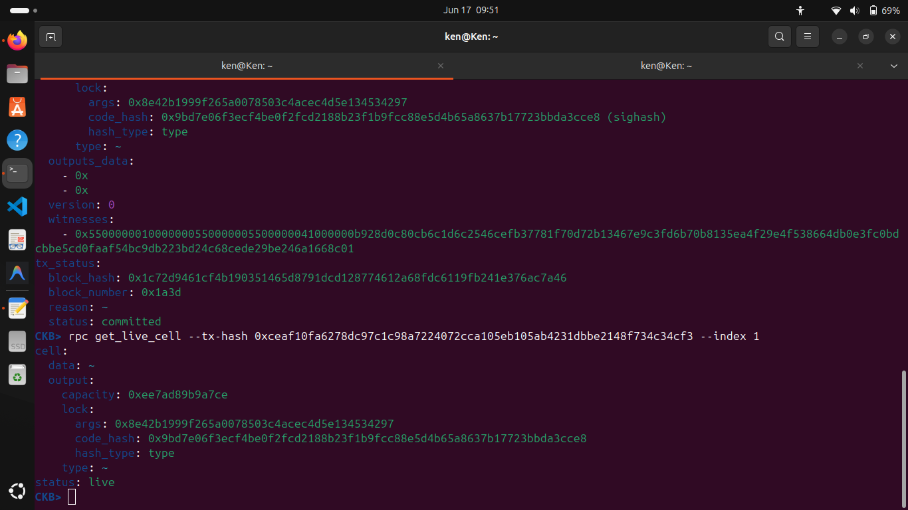
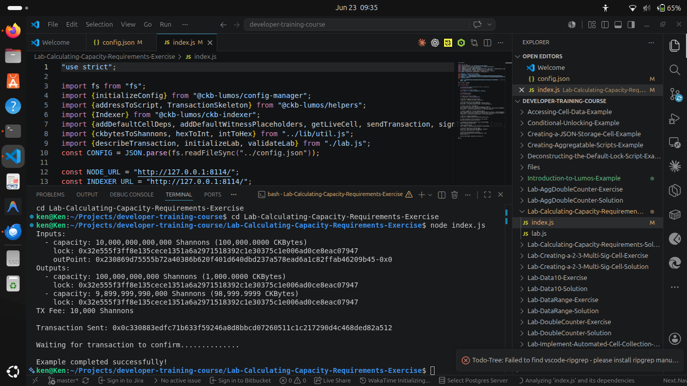

## Builder Track Weekly Report — Week 4

**Name:** Kenneth Komu Njoroge\
**Week Ending:** 06-23-2026

---

### Courses Completed

- **Nervos Developer Training Course — Transactions (continued)**
  - [Lab: Validating Out Points](https://nervos.gitbook.io/developer-training-course/transactions/lab-validating-out-points) — used `rpc get_live_cell` to confirm whether a specific cell is still unspent on-chain.
  - [Sending a Transaction with Multiple Inputs and Outputs](https://nervos.gitbook.io/developer-training-course/transactions/sending-a-transaction-with-multiple-inputs-and-outputs) — learned how to combine multiple input cells and produce multiple outputs in a single transaction.
  - [Components of a Transaction](https://nervos.gitbook.io/developer-training-course/transactions/components-of-a-transaction) — went through each field of a CKB transaction in detail: `cell_deps`, `header_deps`, `inputs`, `outputs`, `outputs_data`, and `witnesses`.
  - [Transaction Lifecycle](https://nervos.gitbook.io/developer-training-course/transactions/transaction-lifecycle) — followed a transaction from construction through broadcast, mempool, and finally committed on-chain.
  - [Introduction to Lumos](https://nervos.gitbook.io/developer-training-course/transactions/introduction-to-lumos) — got started with Lumos, the JavaScript framework for building CKB transactions programmatically.
  - [Lab: Calculating Capacity Requirements](https://nervos.gitbook.io/developer-training-course/transactions/lab-calculating-capacity-requirements) — wrote and ran a Lumos script that calculates capacity, builds a transaction, and sends it to a local dev node.

---

### Key Learnings

- **Validating out points**
  - `rpc get_live_cell` is the tool for checking whether a cell still exists and is unspent. If the status comes back as `live`, the out point is valid and the cell is available to spend. Once a cell is consumed in a transaction, it disappears from the live cell set — you can't spend it again.

- **Multiple inputs and outputs**
  - A transaction isn't limited to one input and one output. You can gather several smaller cells as inputs and produce multiple outputs in a single transaction. The only rule is that the total input capacity must be greater than or equal to the total output capacity — the difference is the fee the miner collects.

- **Transaction components in depth**
  - `cell_deps` — references to cells holding scripts (like the lock script) the transaction depends on.
  - `inputs` — pointers (out points) to existing live cells being consumed.
  - `outputs` — new cells being created, each with a capacity and a lock script.
  - `outputs_data` — the raw data attached to each output cell (empty `0x` if the cell holds no data).
  - `witnesses` — where signatures and any extra data needed by scripts go.

- **Transaction lifecycle**
  - A transaction goes through several stages: constructed locally → broadcast to the node → sitting in the mempool waiting to be picked up → included in a block → committed on-chain. Only once it's committed is it final. The `tx_status` field on `get_transaction` tells you which stage the tx is in.

- **Lumos basics**
  - Lumos is a JavaScript library that handles the low-level work of building CKB transactions: finding live cells, assembling inputs and outputs, calculating fees, adding witnesses, and broadcasting. The key packages used this week were `@ckb-lumos/config-manager`, `@ckb-lumos/helpers`, and `@ckb-lumos/ckb-indexer`.
  - The indexer is what lets Lumos query the chain for live cells belonging to an address — without it you'd have to find your own cells manually.

- **Calculating capacity**
  - Every output cell needs enough capacity to cover the bytes it occupies on-chain. The formula is: each byte of cell data, lock script args, and other fields costs 1 CKByte of capacity. Lumos can compute this automatically, which is one of the main reasons to use it over raw `ckb-cli` for programmatic work.

---

### Proof of Work

**Validating an out point using `rpc get_live_cell` — cell status returned as `live`:**

**Running the capacity requirements lab in VS Code — Lumos builds and sends the transaction successfully:**

---

### Reflections

This week connected the dots between the raw RPC calls I was doing last week and how real applications are actually built on CKB. Seeing Lumos handle cell collection, fee calculation, and broadcasting in a clean script made it obvious why you'd reach for it instead of manually assembling JSON. The capacity formula also clicked — it makes sense that you pay for what you store, and Lumos taking care of that math is a big quality-of-life improvement.

---
