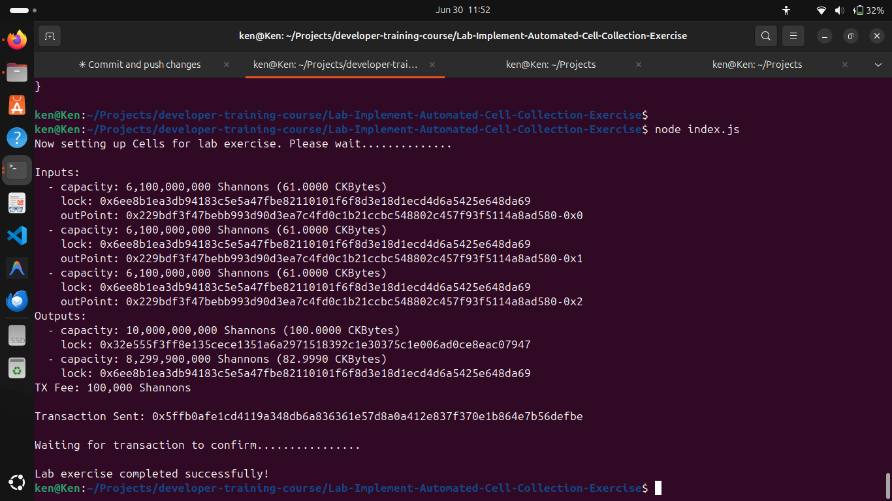
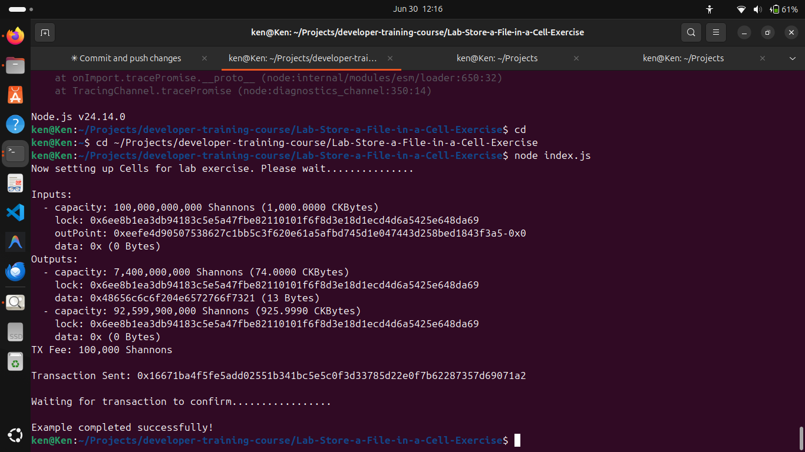
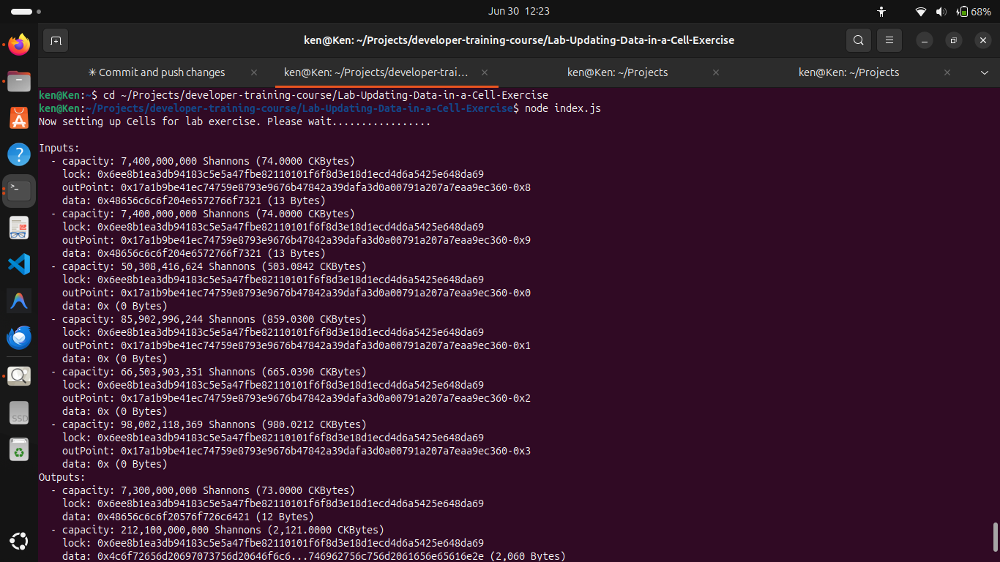
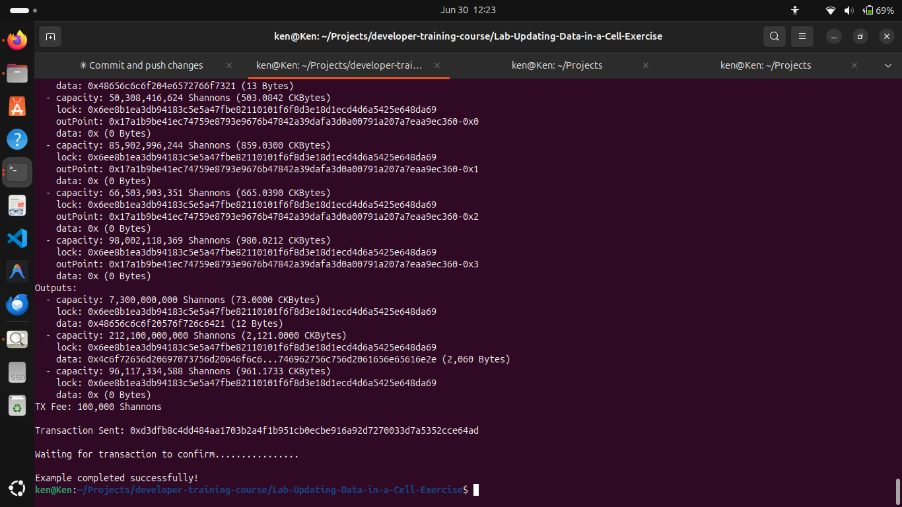

## Builder Track Weekly Report — Week 5

**Name:** Kenneth Komu Njoroge\
**Week Ending:** 06-29-2026

---

### Courses Completed

- **Nervos Developer Training Course — Working with Cell Data**
  - [Lab: Implement Automated Cell Collection](https://nervos.gitbook.io/developer-training-course/transactions/lab-calculating-capacity-requirements) — completed the lab that uses Lumos to automatically collect enough cells to cover a transaction's capacity requirements.
  - [Storing Data in a Cell](https://nervos.gitbook.io/developer-training-course/transactions/storing-data-in-a-cell) — learned how data is stored on-chain, the cost model behind it, and how to do it using both `ckb-cli` and Lumos.
  - [Lab: Store a File in a Cell](https://nervos.gitbook.io/developer-training-course/transactions/lab-store-a-file-in-a-cell) — wrote a Lumos script that reads a file from disk, encodes it as hex, and stores it inside a new cell on-chain.
  - [Updating Data in a Cell](https://nervos.gitbook.io/developer-training-course/transactions/updating-data-in-a-cell) — learned that cells are immutable — "updating" means consuming the old cell and creating a new one in its place.
  - [Lab: Updating Data in a Cell](https://nervos.gitbook.io/developer-training-course/transactions/lab-updating-data-in-a-cell) — built a transaction that locates two specific cells by their data, consumes them, and creates two new cells with different file contents.

---

### Key Learnings

- **Automated cell collection**
  - Instead of manually picking which cells to use, Lumos's `CellCollector` queries the indexer and gathers live cells automatically until the required capacity is met. This is how real dapps handle cell selection — you specify how much you need and it does the rest.

- **Storing data on-chain**
  - Every byte of data stored in a cell costs 1 CKByte of capacity. The minimum cell size is 61 CKBytes (for the cell structure overhead), so a cell with 13 bytes of data needs 74 CKBytes total.
  - In Lumos the `data` field on an output is a hex string. Reading a file and calling `.toString("hex")` is all it takes to get it into the right format.
  - The capacity formula: `61 CKBytes (base) + data size in bytes = total capacity needed`.

- **Cells are immutable — updating means replacing**
  - There is no "edit" operation on CKB. To change what a cell contains, you consume it as a transaction input and create a new cell as the output with the new data. The old cell is destroyed; the new one takes its place. This matters a lot once smart contracts (type scripts) get involved, because the type script on the output is what enforces what the new state is allowed to be.

- **Querying cells by data**
  - `CellCollector` accepts a `data` field in its query: `{lock: lockScript, type: null, data: hexString}`. This lets you find only the cells that contain specific content, which is exactly what the update lab needed — locate the two `HelloNervos.txt` cells before consuming them.

- **Capacity management across labs**
  - The update lab made capacity management more real: the two input cells (74 CKBytes each = 148 CKBytes) were nowhere near enough to cover the LoremIpsum.txt output (2,121 CKBytes). Extra cells had to be collected automatically to make the transaction balance. The change cell returned the leftover capacity.

---

### Proof of Work

**Lab: Implement Automated Cell Collection — 3 input cells collected, 100 CKBytes sent, transaction confirmed:**

**Lab: Store a File in a Cell — HelloNervos.txt stored on-chain as hex data in a 74 CKByte cell:**

**Lab: Updating Data in a Cell — two HelloNervos.txt cells consumed, replaced with HelloWorld.txt and LoremIpsum.txt (inputs and first output visible):**

**Lab: Updating Data in a Cell — full output including 2,121 CKByte LoremIpsum cell, change cell, and confirmed transaction:**

---

### Reflections

This week made the cell model feel very concrete. Writing code that reads a real file, calculates the exact capacity needed, and stores it on-chain removed any remaining abstraction — it's just bytes and math. The update lab was the most interesting: realising you need 2,121 CKBytes for a 2060-byte file but only had 148 CKBytes from the two target cells pushed home why automatic cell collection is essential. You can't plan input amounts by hand in a real dapp.

---
