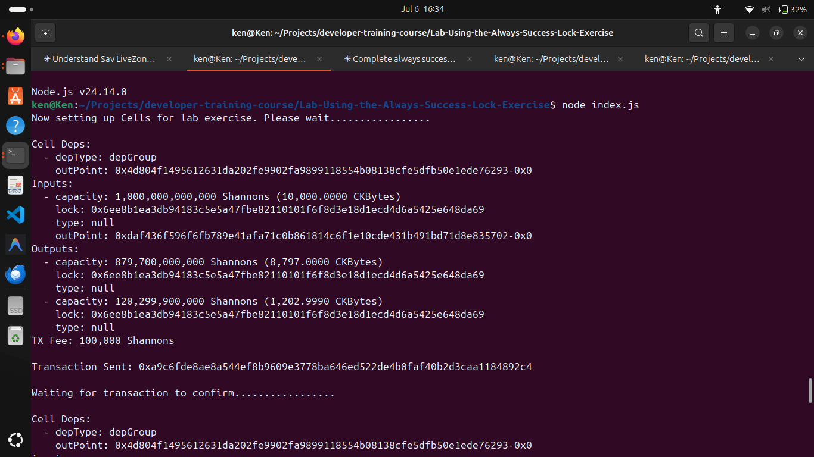
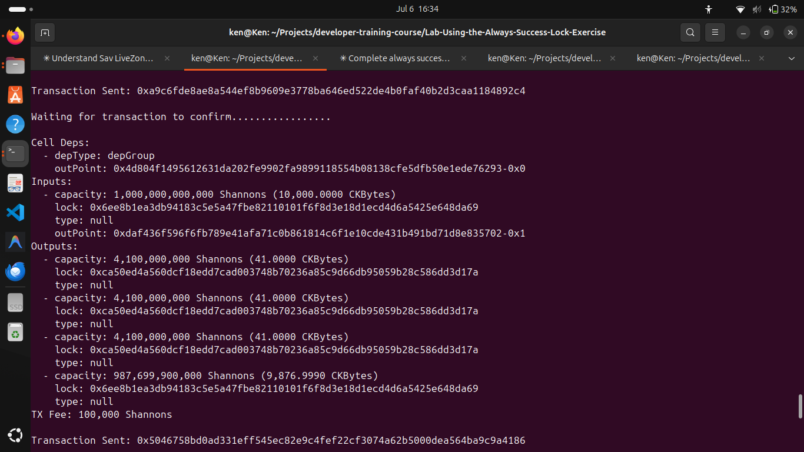
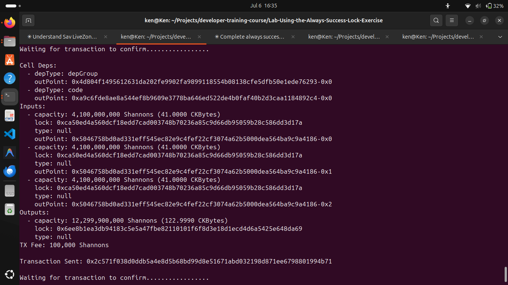

## Builder Track Weekly Report — Week 6

**Name:** Kenneth Komu Njoroge\
**Week Ending:** 07-08-2026

---

### Courses Completed

- **Nervos Developer Training Course — Scripting Basics**
  - [Introduction to Scripting Part 1](https://nervos.gitbook.io/developer-training-course/scripting-basics/introduction-to-scripting-part-1) — learned how scripts work in CKB: they are RISC-V programs that run inside CKB-VM, return 0 on success and non-zero on failure.
  - [Introduction to Scripting Part 2](https://nervos.gitbook.io/developer-training-course/scripting-basics/introduction-to-scripting-part-2) — went deeper into how lock scripts and type scripts differ, and how the VM knows which script to run for each cell.
  - [Using Scripts](https://nervos.gitbook.io/developer-training-course/scripting-basics/using-scripts) — learned how scripts are referenced via `code_hash` and `hash_type`, and how `cell_deps` provide the actual script binary to the VM at execution time.
  - [Lab: Use the Always Success Lock](https://nervos.gitbook.io/developer-training-course/scripting-basics/lab-use-the-always-success-lock) — deployed a script that always exits 0, created cells locked with it, and spent them without any signature.
  - [Introduction to Capsule](https://nervos.gitbook.io/developer-training-course/scripting-basics/introduction-to-capsule) — got introduced to Capsule, the Rust-based framework for writing and testing CKB scripts.
  - [Validating a Transaction](https://nervos.gitbook.io/developer-training-course/scripting-basics/validating-a-transaction) — understood the full validation flow a CKB node runs: checking capacities, executing lock scripts on inputs, and executing type scripts on inputs and outputs.

---

### Key Learnings

- **How scripts work**
  - Every script is a compiled RISC-V binary that runs inside CKB-VM. The VM executes the script and reads its exit code — 0 means the script passed, anything else fails the transaction. Lock scripts run to verify that inputs can be spent; type scripts run to enforce rules on state changes.
  - Scripts communicate with the chain by calling syscalls (`ckb_load_cell`, `ckb_load_witness`, `ckb_load_input`, etc.) — there's no other way to read transaction data from inside the VM.

- **Lock vs type scripts**
  - A **lock script** controls ownership: it answers "is this input allowed to be consumed?" Every input cell runs its lock script. The most common lock is secp256k1, which verifies a signature in the witness.
  - A **type script** controls state: it answers "is this state transition valid?" Type scripts run on both inputs and outputs and are used to enforce smart contract rules, like token balances staying consistent.

- **How scripts are referenced (code_hash and hash_type)**
  - A script is not stored directly in the cell — instead the cell holds a `code_hash` that points to it. The `hash_type` field controls what the hash refers to:
    - `"data"` → Blake2b hash of the raw binary
    - `"type"` → hash of the type script on the cell that holds the binary
  - The actual binary lives in a separate cell and is loaded at runtime via `cell_deps`. The transaction must include that cell dep or validation fails.

- **The Always Success lock**
  - The simplest possible lock script: a binary that immediately exits with code 0. Any transaction spending a cell with this lock will always pass, with no signature or witness required.
  - Useful for understanding the execution model and for testing — you can create and spend cells without worrying about keys. In production, this would obviously be dangerous since anyone could spend the cell.

- **Transaction validation flow**
  - When a node validates a transaction it checks: input cells exist and are live → capacity is balanced → lock scripts on all inputs pass → type scripts on all relevant inputs and outputs pass. Only once all of these pass is the transaction accepted into the mempool.

---

### Proof of Work

**Lab: Use the Always Success Lock — setup transaction splits 10,000 CKBytes, first transaction deploys the always success script binary and creates 3 cells locked with it:**

**Second transaction showing 3 × 41 CKByte cells created with the always success lock hash, and 9,876 CKBytes change:**

**Final transaction consuming all three always-success cells without any signature — 122.999 CKBytes consolidated back to the main address:**

---

### Reflections

The always success lab made the script execution model very real. Seeing a transaction go through with no witness or signature — just a binary that exits 0 — clarified that the lock script is just code, and the chain runs it and trusts the result. The split between lock scripts and type scripts also clicked better this week: one is about who owns a cell, the other is about what the cell is allowed to become. That distinction is going to matter a lot as we move into writing actual smart contracts.

---
