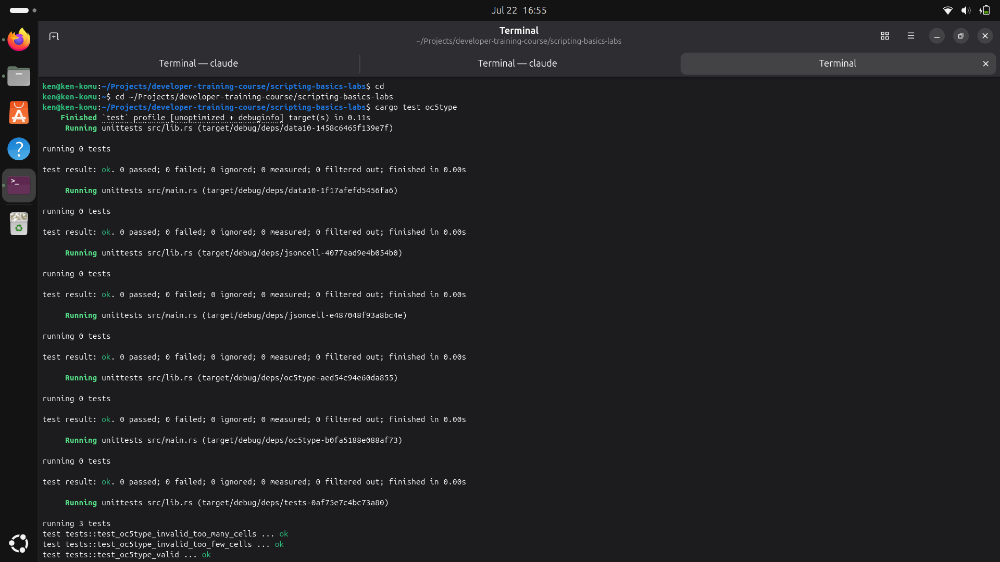
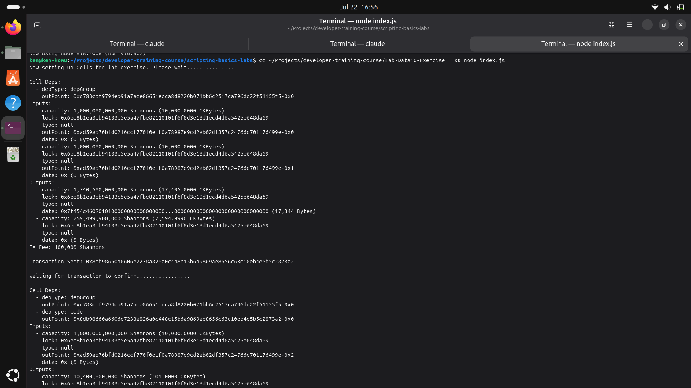
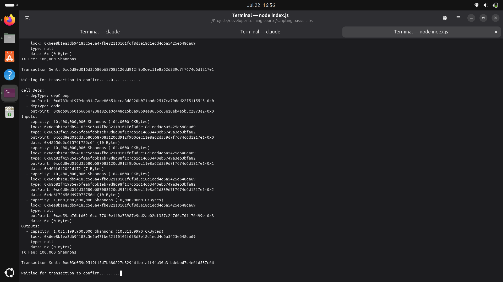

## Builder Track Weekly Report — Week 7

**Name:** Kenneth Komu Njoroge\
**Week Ending:** 07-15-2026

---

### Courses Completed

- **Nervos Developer Training Course — Scripting Basics (continued)**
  - [Lab: Convert IC3Type to OC5Type](https://nervos.gitbook.io/developer-training-course/scripting-basics/lab-convert-ic3type-to-oc5type) — modified a type script that counts input cells (succeeds at 3) into one that counts **output** cells (succeeds at 5).
  - [Syscalls](https://nervos.gitbook.io/developer-training-course/scripting-basics/syscalls) — learned how a script reads transaction data from inside CKB-VM using syscalls, and the high-level `ckb-std` wrappers that sit on top of them.
  - [Accessing Cell Data](https://nervos.gitbook.io/developer-training-course/scripting-basics/accessing-cell-data) — learned how to read a cell's data field from within a script and validate it.
  - [Lab: Convert Always Success to Data10](https://nervos.gitbook.io/developer-training-course/scripting-basics/lab-convert-always-success-to-data10) — used the `data10` type script to create and consume cells, where each cell is limited to a maximum of 10 bytes of data.
  - [Script Groups](https://nervos.gitbook.io/developer-training-course/scripting-basics/script-groups) — learned how identical scripts are grouped and executed once per group, and how `GroupInput`/`GroupOutput` differ from `Input`/`Output`.
  - [Lab: Convert Always Success to JSONCell](https://nervos.gitbook.io/developer-training-course/scripting-basics/lab-convert-always-success-to-jsoncell) — used the `jsoncell` type script, which requires every cell it guards to contain valid JSON.

---

### Key Learnings

- **Syscalls — how a script sees the transaction**
  - A script running inside CKB-VM has no direct access to the chain. Every piece of information it needs — inputs, outputs, cell data, witnesses, the script itself — is pulled in through **syscalls**.
  - In Rust, `ckb-std` provides high-level wrappers so you rarely call the raw syscalls: `load_cell`, `load_cell_data`, `load_script`, `load_witness`, and `QueryIter` for iterating over them cleanly.
  - The **`Source`** parameter decides where you're reading from: `Input`, `Output`, `CellDep`, and the grouped variants `GroupInput`/`GroupOutput`.

- **Counting cells (IC3Type → OC5Type)**
  - The whole conversion came down to two changes: the required count (`3` → `5`) and the source being counted (`Source::Input` → `Source::Output`).
  - The loop reads cells one index at a time until `load_cell` returns `IndexOutOfBound`, which is simply how you detect "there are no more cells."

- **Accessing cell data (Data10)**
  - `load_cell_data(i, source)` returns the raw bytes of a cell's data field, separate from its structure (capacity, lock, type).
  - A type script executes on **both inputs and outputs**, so Data10 loads the current script with `load_script`, walks the outputs, and only enforces the 10-byte limit on the cells whose type script matches its own — everything else is ignored.

- **Script groups (JSONCell)**
  - Identical scripts are placed into a **script group** and executed **once** per group, not once per cell.
  - Reading from `Source::GroupOutput` returns **only** the cells that use the currently-executing script, which removes the manual "does this cell use my script?" filtering that Data10 had to do. JSONCell just iterates its group's output data and validates each as JSON.
  - Note: a lock script asking for `GroupOutput` gets nothing back — lock scripts only run against inputs.

- **Tooling: modern flow vs the deprecated one**
  - Per the CKBuilder Handbook, Lumos and Capsule are now deprecated. For the Rust script (OC5Type) I built and tested it with the modern **ckb-script-templates** + **ckb-testtool** flow (`make build` / `cargo test`) instead of Capsule.
  - The Data10 and JSONCell labs are Lumos exercises that run against a local **CKB dev blockchain**, so I stood up a dev node, funded the genesis account, and ran them with `node index.js`.
  - A subtle detail that tripped me up: the provided `data10`/`jsoncell` binaries are **VM0** binaries, so the type script had to reference them with `hashType: "data"` (not `"data1"`). I confirmed this by matching the expected script hash.

---

### Proof of Work

**Lab: Convert IC3Type to OC5Type — the OC5Type type script compiled and all three unit tests pass (too few cells, too many cells, and exactly five):**

**Lab: Convert Always Success to Data10 — deploying the data10 binary (17,344 bytes) to a cell on the dev chain and funding the working account:**

**Lab: Convert Always Success to Data10 — creating three cells (104 CKBytes each) that use the data10 type script, holding "HelloWorld", "Foo Bar", and "LoremIpsum":**

**Lab: Convert Always Success to JSONCell — using the jsoncell type script (which accepts only cells containing valid JSON), the lab deployed the binary, created three cells holding valid JSON values, and consumed them, finishing with `Exercise completed successfully!`.**

<!-- Optional: capture a screenshot of `node index.js` in Lab-JSONCell-Exercise and add it here as images/CKB7.4.png -->

---

### Reflections

This week was where scripting stopped being theory and started being something I could actually run. The OC5Type conversion looked trivial on paper — change a 3 to a 5 and swap inputs for outputs — but building, testing, and watching the three cases pass (too few, too many, and exactly right) made the counting-loop pattern and the `IndexOutOfBound` "end of list" trick concrete. Data10 and JSONCell then layered on the two ideas that matter most for real type scripts: reading a cell's data, and only caring about the cells that actually use your script. Script groups made that second part click — `GroupOutput` does the filtering for you, so JSONCell ended up much shorter than Data10 for essentially the same shape of work. The biggest lesson wasn't in the lab text at all: getting the Lumos labs running on a local dev node, and figuring out that the provided binaries were VM0 (so `hashType: "data"`), taught me more about how scripts are referenced and deployed than any single reading did.

---
