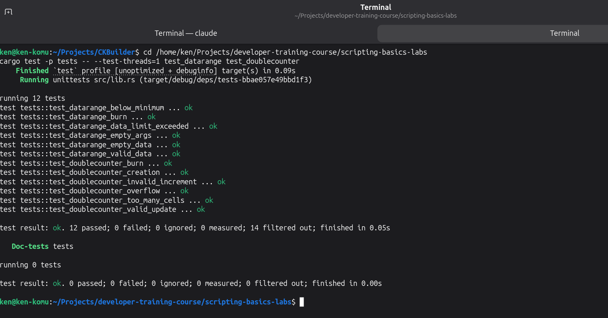
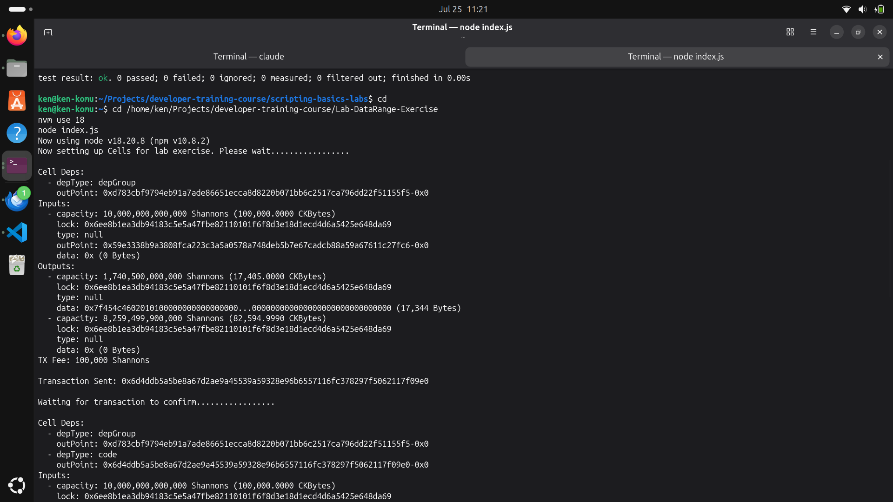
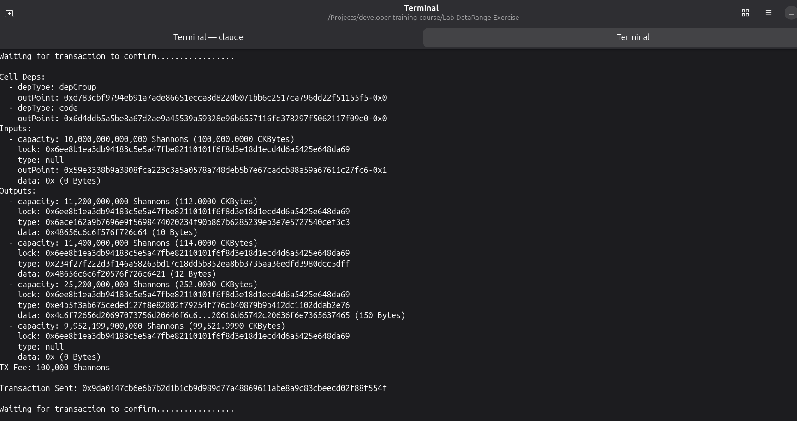
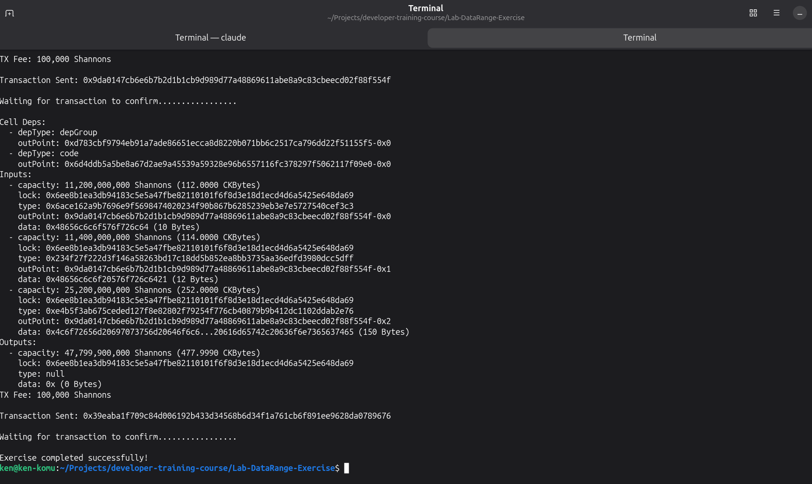

## Builder Track Weekly Report — Week 8

**Name:** Kenneth Komu Njoroge\
**Week Ending:** 07-22-2026

---

### Courses Completed

- **Nervos Developer Training Course — Scripting Basics (continued)**
  - [Using Script Args](https://nervos.gitbook.io/developer-training-course/scripting-basics/using-script-args) — learned how to make a type script configurable by reading its limits from the `args` field instead of hard-coding them, using the DataCap example.
  - [Lab: Convert DataCap to DataRange](https://nervos.gitbook.io/developer-training-course/scripting-basics/lab-convert-datacap-to-datarange) — converted the single-value DataCap size check into a two-value DataRange check (minimum and maximum), built and tested with ckb-script-templates + ckb-testtool.
  - [Lab: Use the DataRange Script in Lumos](https://nervos.gitbook.io/developer-training-course/scripting-basics/lab-use-the-datarange-script-in-lumos) — deployed the DataRange binary and created/consumed three cells, each with data sized to fall inside its own `[min, max]` range, against a local CKB dev node.
  - [Managing Script State](https://nervos.gitbook.io/developer-training-course/scripting-basics/managing-script-state) — learned how a script persists data across transactions by storing it in a cell's data field, using the Counter example (input value + 1 = output value).
  - [Lab: Convert the Counter to a Double Counter](https://nervos.gitbook.io/developer-training-course/scripting-basics/lab-convert-the-counter-to-a-double-counter) — converted the single-counter script into one that tracks two u64 values in the same cell, incrementing by 1 and 2 respectively on every update.

---

### Key Learnings

- **Script args as configuration**
  - Lock scripts and type scripts both accept `args`, the same way a program accepts a command-line argument. Moving a limit out of the script body and into `args` means the same compiled binary can enforce different rules for different cells, just by changing the args bytes used to build the script.
  - DataRange reads two u32 LE values (min, max) out of an 8-byte `args` field, instead of DataCap's single 4-byte max. Getting the arg length check right (exactly 8 bytes, or reject) mattered as much as the range comparison itself.

- **DataCap → DataRange conversion**
  - The core logic barely changed: DataCap already looped over the output cells matching its own type script and checked `data.len() > max`. DataRange just replaced that with `data.len() < min || data.len() > max`, with `min`/`max` coming from the parsed args instead of a constant.
  - Same VM0 gotcha as Week 7: the provided `datarange` binary needed `hashType: "data"` in the Lumos script object, not `"data1"`. I reused the same script-hash brute-force approach to confirm it before wiring up the lab.

- **Managing state across transactions (Counter → DoubleCounter)**
  - A cell is immutable — "updating" a Counter means consuming the old cell and creating a brand-new one with the incremented value; there's no in-place mutation. The script's whole job is to verify that the new cell's data is a valid successor to the old one's.
  - DoubleCounter extends this to two independent u64 values in one 16-byte data field, each with its own increment rule (+1 and +2). Using `Source::GroupInput`/`GroupOutput` (from Week 7's Script Groups lesson) made the three cases — creation (no group input), burn (no group output), and update (exactly one of each) — easy to separate cleanly.
  - Overflow needed explicit handling: `checked_add` on both counters, returning a distinct error code rather than silently wrapping.

---

### Proof of Work

**Rust unit tests for DataRange and DoubleCounter — 12 tests covering valid ranges, below-minimum, limit-exceeded, empty args, burns, valid updates, invalid increments, overflow, and too-many-cells, all passing:**

**Lab: Use the DataRange Script in Lumos — deploying the datarange binary (17,344 bytes) to the dev chain:**

**Lab: Use the DataRange Script in Lumos — creating three cells (10, 12, and 150 bytes of data) each guarded by a DataRange type script with matching `[min, max]` args:**

**Lab: Use the DataRange Script in Lumos — consuming all three cells in a single transaction, finishing with `Exercise completed successfully!`:**

---

### Reflections

This week connected two ideas that felt separate before: configurable scripts via `args`, and scripts that track state across transactions. DataRange was a small, almost mechanical change from DataCap, but it made clear why args exist at all — the same compiled binary now enforces three completely different size constraints just by changing 8 bytes. DoubleCounter was the more interesting one: it forced me to actually reason about a cell as a value that gets replaced rather than mutated, and to use script groups to cleanly tell apart creation, burning, and updating without writing three separate scripts. Running the DataRange Lumos lab again against the local dev node was much faster this time — the devnet, config, and the VM0 `hashType: "data"` fix from Week 7 were all already in place, so the only new work was the actual lab logic.

---
