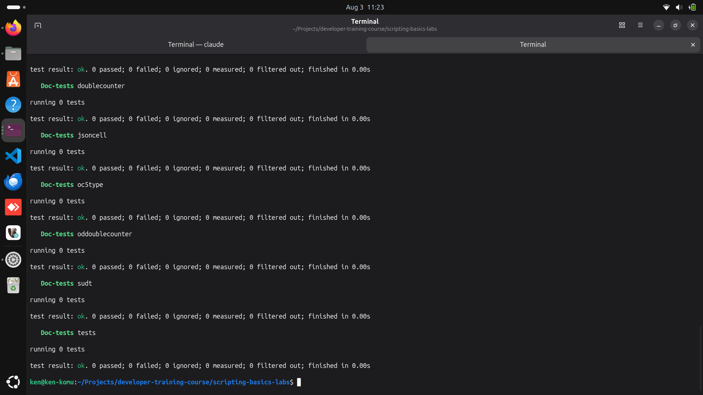
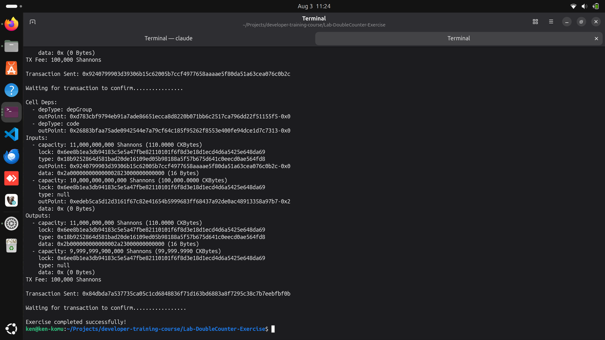
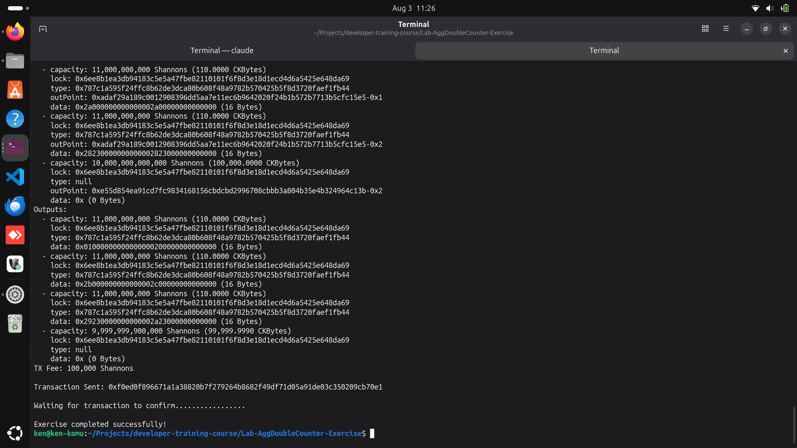
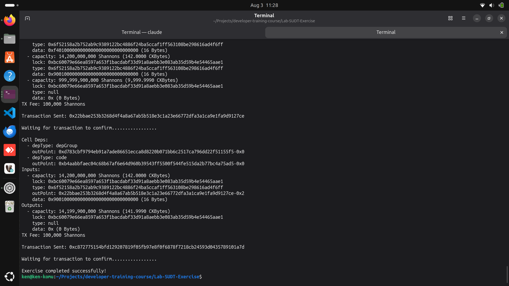

## Builder Track Weekly Report — Week 9

**Name:** Kenneth Komu Njoroge\
**Week Ending:** 07-29-2026

---

### Courses Completed

- **Nervos Developer Training Course — Scripting Basics (continued)**
  - [Lab: Use the Double Counter in Lumos](https://nervos.gitbook.io/developer-training-course/scripting-basics/lab) — deployed the DoubleCounter binary from Week 8 and used it in a Lumos transaction: created a cell holding two starting values (42, 9000) and updated it, incrementing them by 1 and 2.
  - [Creating Aggregatable Scripts](https://nervos.gitbook.io/developer-training-course/scripting-basics/creating-aggregatable-scripts) — learned the "minimal concern pattern": instead of requiring exactly one input/output pair, a script loops through every group input/output pair by index, so any number of matching cells can be processed together in one transaction.
  - [Lab: Convert the Double Counter to an Aggregatable Double Counter](https://nervos.gitbook.io/developer-training-course/scripting-basics/lab-convert-the-double-counter-to-an-aggregatable-double-counter) — rewrote DoubleCounter into AggDoubleCounter, which validates any number of 1:1 update pairs instead of exactly one.
  - [Lab: Use the Aggregatable Double Counter in Lumos](https://nervos.gitbook.io/developer-training-course/scripting-basics/lab-use-the-aggregatable-double-counter-in-lumos) — used AggDoubleCounter to create and update three separate counter cells in a single transaction.
  - [Operation Detection](https://nervos.gitbook.io/developer-training-course/scripting-basics/operation-detection) — learned to classify a transaction's intent (Burn / Create / Transfer) by counting group inputs and outputs, then dispatching to a dedicated validation function for each case.
  - [Lab: Add Operation Detection to the Double Counter](https://nervos.gitbook.io/developer-training-course/scripting-basics/lab-add-operation-detection-to-the-double-counter) — rebuilt DoubleCounter as ODDoubleCounter using explicit `determine_mode()` dispatch instead of implicit group-count filtering, including a rule that a freshly created counter must start at (0, 0).
  - [Creating a Token](https://nervos.gitbook.io/developer-training-course/scripting-basics/creating-a-token) — learned how Nervos's SUDT (Simple User-Defined Token) standard works: an "owner mode" check via lock-hash matching, and a scarcity rule (`input tokens >= output tokens`) for everyone else.
  - [Lab: Use an SUDT in Lumos](https://nervos.gitbook.io/developer-training-course/scripting-basics/lab-use-an-sudt-in-lumos) — built the SUDT type script from scratch and used it in Lumos to mint tokens for two accounts, transfer tokens between three accounts, and burn the remaining tokens.

---

### Key Learnings

- **The minimal concern pattern (Aggregatable Scripts)**
  - DoubleCounter only ever checked "is there exactly one group input and one group output?" AggDoubleCounter drops that restriction entirely: it counts the group inputs and outputs, requires them to match, then loops through every index validating that pair's increment independently.
  - This is what makes a script "composable" — it doesn't care how many of its own cells are in a transaction, only that each one individually obeys the rule. The Lumos side of this mattered just as much as the Rust side: building a transaction with three cells and three matching outputs, then reading each input's value back out to compute its own output, was the first time I had to loop transaction construction itself rather than write it as one fixed sequence of steps.

- **Operation detection vs. implicit group-count checks**
  - DoubleCounter's original burn/create/update logic worked by checking `is_empty()` on group inputs and outputs directly. ODDoubleCounter makes the exact same three cases explicit through a `determine_mode()` function and a `Mode` enum, then routes to `validate_create()`, `validate_transfer()`, or a no-op for burn.
  - The practical difference showed up in a rule I had to decide on myself: the lesson's Counter example enforces that a freshly created cell's data must be exactly `0u64`, but the DoubleCounter lab description didn't spell out a starting value. I carried the same convention over — a newly created ODDoubleCounter cell must start at `(0, 0)` — and wrote a test to lock that in, since operation detection only works if "create" has an unambiguous, checkable definition.

- **SUDT: authorization delegation and scarcity**
  - The most interesting design idea this week: SUDT doesn't implement its own signature checking. Its type script args hold the owner's lock **hash**, and `check_owner_mode()` just asks "is any input in this transaction already locked by that hash?" If the owner's lock script is already unlocking one of the inputs (which required its own valid signature to get this far), the type script trusts that and skips further checks — that's the "authorization delegation" from the lesson.
  - Everyone else who isn't the owner is bound by one rule: `input_token_amount >= output_token_amount`, checked by summing the first 16 bytes (a u128 LE) of every cell's data in the script's own group. That single inequality is the entire scarcity guarantee — nobody can create tokens out of thin air, they can only move or destroy what's already there.
  - Running the full lab end to end (mint 100/300/700 tokens for Alice and 900 for Daniel, transfer 200 to Bob and 500 to Charlie while Alice keeps 400 change, then burn Alice's remaining tokens and recover the CKBytes) worked on the first attempt, which was the best confirmation that the owner-mode/scarcity split was implemented correctly.

---

### Proof of Work

**Full workspace test suite — 43 Rust unit tests across all six contracts, including 17 new tests for AggDoubleCounter, ODDoubleCounter, and SUDT, all passing:**

**Lab: Use the Double Counter in Lumos — creating a cell with values (42, 9000) and updating it to (43, 9002), finishing with `Exercise completed successfully!`:**

**Lab: Use the Aggregatable Double Counter in Lumos — creating and updating three separate counter cells (starting at (0,0), (42,42), and (9000,9000)) in a single aggregated transaction:**

**Lab: Use an SUDT in Lumos — minting tokens for Alice and Daniel, transferring tokens between Alice, Bob, and Charlie, and burning Alice's remaining tokens, finishing with `Exercise completed successfully!`:**

---

### Reflections

This was the biggest week yet in terms of scope, but it was really three variations on one idea: a type script only needs to care about the cells that share its own script group, and everything else about *how* it does that is a design choice, not a fixed rule. Aggregatable scripts choose to process many cells at once by looping over matched pairs. Operation detection chooses to name its cases explicitly instead of leaving them implicit in a count check. SUDT chooses to delegate authorization to whichever lock script the owner already trusts, rather than reimplementing signature verification itself. None of these are more "correct" than DoubleCounter's original approach — they're trade-offs for composability, clarity, or reuse. Building SUDT from the lesson's algorithm rather than looking at a finished implementation, and having the full mint/transfer/burn cycle work end to end on the first run, was the clearest sign yet that the pattern — read the group's cells, decide what changed, enforce one narrow rule — is starting to feel like a default way to think about a script rather than something I have to re-derive each time.

---
